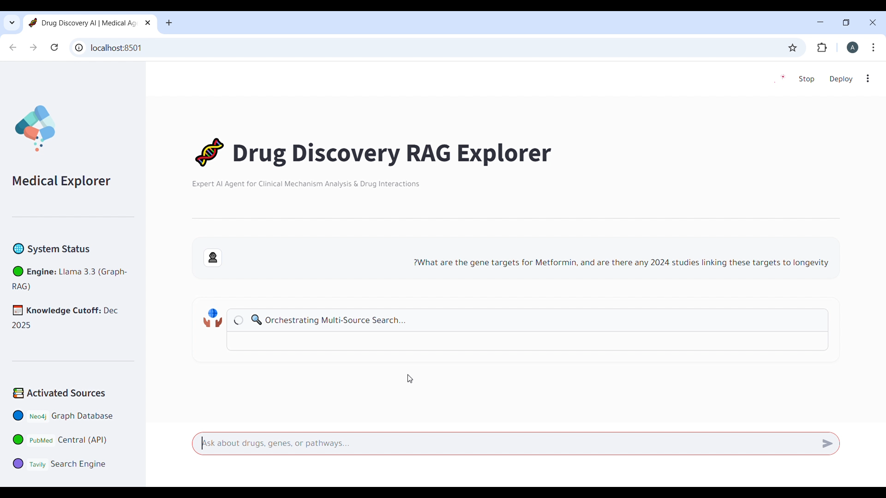
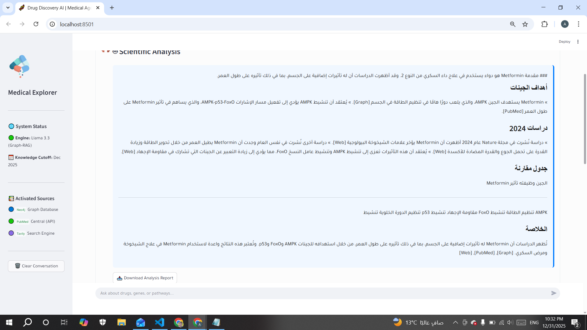

# 🧬 Drug Discovery AI Agent (Advanced Graph RAG System)

A sophisticated AI-driven Drug Discovery Explorer leveraging **Graph RAG** architecture. This system unifies structured Knowledge Graphs (Neo4j), semantic vector search (ChromaDB/PubMed), and real-time web intelligence (Tavily) to provide high-fidelity, cited analysis of drugs, genes, and molecular pathways.

---

## 🚀 Project Concept: The Power of Graph RAG

In the pharmaceutical domain, information is often fragmented. Traditional RAG (Vector-only) often fails to capture the complex, interconnected nature of biological data. This project implements a **Graph-Augmented Retrieval (Graph RAG)** approach to ensure:

1. **Relational Accuracy:** Unlike simple text matching, our Graph RAG tracks "Drug-Target-Disease" relationships as structured paths in Neo4j, preventing logical hallucinations.
2. **Contextual Synthesis:** It bridges gaps by parallel fetching data from a **Knowledge Graph**, **Vector Store** (PubMed), and **Live Web Search**.
3. **Multi-Hop Reasoning:** The agent can reason across diverse data types using **Llama 3.3**, answering complex questions by traversing graph nodes and grounding them with 2024-2025 clinical updates.

---

## 📸 System in Action

| Stage 1: Query & Multi-Source Search | Stage 2: Synthesized Scientific Analysis |
| --- | --- |
|  |  |
| *Agent orchestrating Graph, PubMed, and Web retrieval.* | *Final clinical report with grounded citations and RTL support.* |

---

## 🏗️ Directory Structure

```text
DrugDiscoveryRAG/
├── .env                  # API Keys & DB Credentials
├── .gitignore            # Excluded files from git
├── README.md             # Documentation
├── requirements.txt      # Project Dependencies
├── main.py               # FastAPI Backend (Orchestration Layer)
├── app.py                # Streamlit Frontend (User Interface)
├── setup.sh              # Environment setup script
├── core/
│   ├── __init__.py
│   ├── config.py         # App Configuration & Prompts
│   ├── agent.py          # Central RAG Logic & Tool Calling
│   └── embedder.py       # Vector Embedding Logic
├── tools/
│   ├── __init__.py
│   ├── pubmed.py         # PubMed API Integration
│   ├── web_search.py     # Tavily Web Search Tool
│   ├── graph.py          # Neo4j Cypher Generation & Querying
│   └── vector_db.py      # ChromaDB Operations
├── tests/                # Unit & Integration Tests
│   ├── test_agent.py
│   └── test_pubmed.py
└── data/                 # Local data storage & knowledge seeds

```

---

## 🛠️ Key Features

* [x] **Hybrid Retrieval:** Merges Cypher queries (structured facts) with Semantic Search (unstructured literature).
* [x] **2025 Data Accuracy:** Real-time web integration captures medical warnings and papers published as recently as this month.
* [x] **Professional UI:** A Streamlit dashboard featuring custom CSS, **RTL support** for Arabic analysis, and high-fidelity medical icons.
* [x] **Medical Citations:** Automatically organizes evidence into separate tabs (Graph, PubMed, Web) for transparency.
* [x] **Interactive Reports:** Ability to download the generated scientific analysis as a Markdown report.

---

## 💻 Installation & Setup

### 1. Clone the Repository:

```bash
git clone https://github.com/Ahmadgatany/drug-discovery-rag-agent.git
cd drug-discovery-rag-agent

```

### 2. Install Dependencies:

```bash
pip install -r requirements.txt

```

### 3. Environment Configuration

Create a `.env` file in the root directory:

```env
OPENROUTER_API_KEY=your_key_here
NEO4J_URI=bolt://localhost:7687
NEO4J_PASSWORD=your_password
TAVILY_API_KEY=your_key_here

```

### 4. Run the Application

**Start the Backend:**

```bash
python main.py

```

**Start the Frontend:**

```bash
streamlit run app.py

```

---

## 📊 Example Queries

* *"Compare the molecular mechanism of Metformin vs Sitagliptin."*
* *"Are there any 2024-2025 warnings for Semaglutide regarding kidney function?"*
* *"Show the gene target and common side effects for Empagliflozin."*

---

## 🛡️ Disclaimer

*This system is for research purposes only. AI analysis should not replace professional medical judgment, diagnosis, or treatment. Always consult with a qualified healthcare provider.*

**Developed with ❤️ for the BioTech AI Community.**
